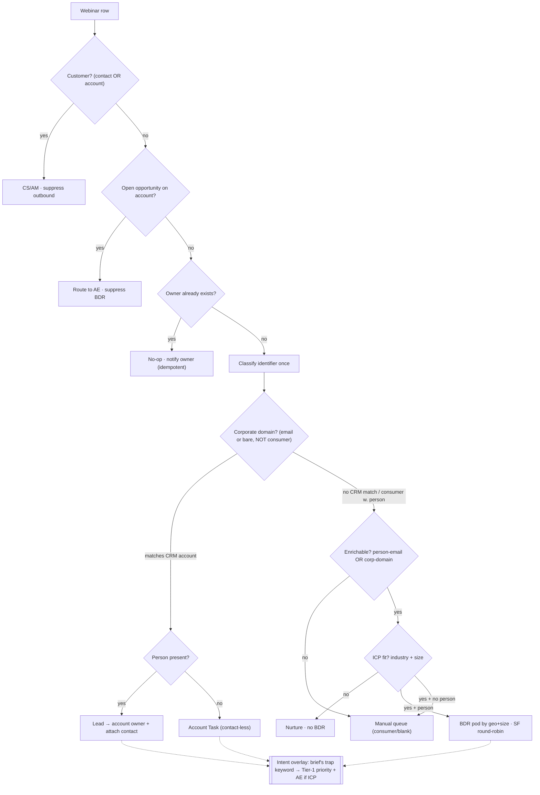
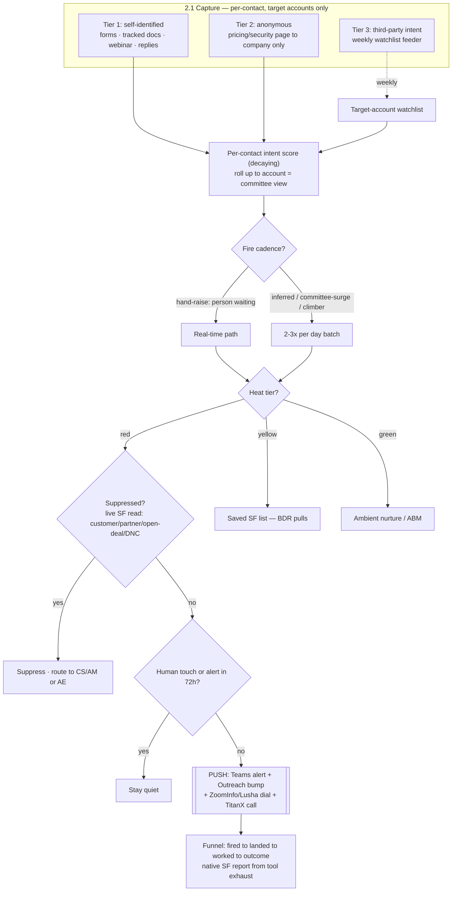
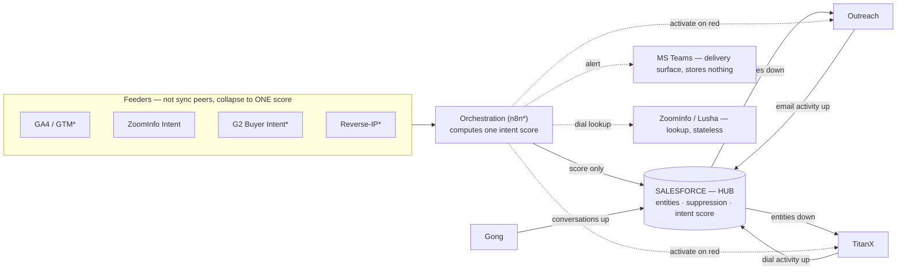

# Dot Compliance — GTM Engineer Take-Home

> A GTM-engineering architecture for Dot Compliance's revenue stack. Built to be the most *defensible* doc, not the longest — it opens with the finding, not the menu of options.

## Thesis / through-line
Your own webinar proves it: **self-reported intent is noise — one real buying signal in 83 registrants, and it sits on a row we can't even cleanly identify.** So the two builds split cleanly:
- **Option 1** is the hygiene/routing layer that gets clean leads into Salesforce.
- **Option 2** is the engine that actually generates pipeline — on *behavioral* signal from a separate source, because that's where the real intent lives, not in what people tell a registration form.

One dataset exposed the problem; the two builds are the fix.

---

## Option 1 — Ingestion Pipeline
*(Built and runnable — every number below is a real run on the actual 83-row file; the code is in the appendix.)*

### The finding (open the room with this)
We built the brief's content trap — all four terms (*validate AI QMS / Veeva / MasterControl / replace*) scanned across the three free-text columns for all 83 registrants — and it fires **exactly once** (our measured count on the file; the brief lists the four terms but states no count of its own). That one hit is *"How to validate AI QMS"*: a genuine **evaluation** question, **not** a competitor or replacement mention (those score zero). And, tellingly, it comes from a **contact-less row** (bare domain `vitalant.org`, no name), so we can't even cleanly act on the one real signal. **Self-report intent at ~1/83 is noise.** That's not a complaint about the data — it's the argument: Option 1 is the hygiene/routing layer that gets clean records into Salesforce; the pipeline that *generates* intent (Option 2) has to run on a different signal source.

### What Option 1 is, plainly
A function that takes one messy webinar row and decides three things: **who owns it, what gets written to Salesforce, and how urgent it is** — cheaply, and without ever putting two reps on the same logo or cold-outbounding a customer.

### The second finding: the data is *rigged*, not just messy
As important as the 1/83: this export is **adversarial by construction**. One pool of ~30 real life-sciences companies was split across three columns and **shuffled by independent per-column permutations**, so the columns disagree on purpose:
- **`Email`-domain + `Company type` were shuffled together** (they corroborate each other), while **`Organization` was shuffled separately** — which makes Organization the *poison* column. On **22 of 23** corporate bare-domain rows the Organization fails to corroborate the email domain (only `lifesync.com` is a fixed point): **21** name a *different* company, in traceable cycles (`clario.com`/Org=Sanofi → `sanofi.com`/Org=Broad Spectrum GXP → …), and **1** (row 81) is junk — a phone number sitting in the org field, not a company at all.
- The two **`Country` columns were not shuffled at all** — they agree on 100% of rows, which is why geography reads cleanly from the ISO column and **never** from the email TLD (which contradicts ISO on 5 rows).

The line that drives the whole design: **the email domain is authoritative for the 52 named (`@`-email) rows and *poison* for the 31 nameless bare-domain rows** — so the pipeline may not treat them identically. Trusting any single field is the exact mistake the dataset is built to punish. The signal-trust ranking we route by:

| Trust | Fields |
|---|---|
| **Authoritative** | `Country/Region` ISO (+ Name) — clean anchor, not shuffled |
| **Corroborating** | full `@`-email domain · corporate bare-domain · `Company type` · phone (w/ country code) |
| **Poison** | `Organization` (deranged) · `Assigned To` (blank 82/83) · email TLD for geo · satisfaction rating for attendance |

**What this changes in the build — and where we drew the line.** Two cheap, thesis-protecting pieces are **wired in**. (1) Contact-less rows key on a **surrogate** (not the raw domain), so the two `vitalant.org` rows can't merge and the one buying signal can't be erased, plus a `shared_domain_collision` flag routes such rows to human review. (2) A `company_conflict` **detector** compares the email domain against `Organization` on contact-less corporate-bare rows — where Organization is the poison column — and on a mismatch (**21** of the 23, clearing only the `lifesync.com` fixed point) downgrades confidence to low and routes to human review. It is a *detector, not a resolver*: it flags the disagreement and never picks the "true" company, because the partial shuffle destroyed it. The 22nd non-corroborating row (row 81) carries a **junk** org — a phone number, not a company name — so a separate `org_junk` flag ignores it for matching/enrichment and records *why* (the field was junk, not merely blank); the bright line is *"contains no alphabetic character"* (the robust form of `str.isdigit()`, so it still fires on a hyphenated phone like `812-325-5522`), never a "is this name real" judgment (that would be the resolver). Named rows are left on email-as-employer (defensible, 2 rows). All verified idempotent (two runs, byte-identical output). What stays **narrated, not built** is the *resolver* — scoring a confidence from how many independent signals (email-domain, `Company type`, `Organization`, ISO) agree and resolving identity from it: a confidence-scored identity resolver for 83 leads, which *is* the over-tooling trap. We scope it and defer it to the volume where it pays (the CDP question in the cost section).

### 1.1 Routing waterfall
Ordered **cheap + terminal gates first, paid enrichment last** — so we never pay to enrich a row we could resolve for free.



**Why this order (the defenses):** customer + open-opp first because cold-outbounding a customer or an active-deal account is the error that gets noticed first; owner-exists next because it's free and terminal (idempotent no-op); **account-match keyed on the corporate domain extracted from *either* a full email or a bare domain** (`john@clario.com` and `clario.com` both → `clario.com`), because account integrity (never two reps on one logo) is the invariant; **enrichment only on the residue**, ICP-fit-gated, because at this volume paying to enrich every unknown is the over-tooling trap. Geography is read from the clean ISO country column — **never inferred from the email TLD** (`gmx.de` is a US registrant in this file).

### 1.2 The intent overlay (honest by construction)
The brief's four-term content trap fires **once in 83** — our measured count on the data (the brief names the four terms; the count is ours). Two *types*, never conflated: **competitor/displacement** mentions (Veeva/MasterControl/replace → **0**) and a genuine **evaluation question** ("validate AI QMS" → **1**); both are Tier-1 hits but route to different plays (battlecard vs SE/AE technical follow-up). Topical AI interest (several comments) is *not* escalated — it's not buying intent. The one hit raises priority and loops in an AE if the account is ICP. We don't fuzzy-match or drop the brief's term to massage the number — **one is the honest count, and 1/83 is the point.**

### 1.3 The data contract — keys, idempotency, write policy
- **Dedup key:** normalized email if `@` present (person); else a per-registration **surrogate** (corporate-domain anchor + a stable row hash) for contact-less rows. A bare domain is **never the key on its own** — two unrelated registrants can share it (the two *contact-less* `vitalant.org` rows — a third, `ssaha@vitalant.org`, is a named row keyed on its email, so three registrations share the domain in all), and an upsert on the shared key would destructively merge the contact-less pair. The corporate domain is kept separately as `account_domain` (a non-destructive account hint), never a merge key. Every row gets a stable key → idempotent re-ingest.
- **Idempotency:** every write is an **upsert on a deterministic key** (person, account, and `(person + webinar)` for attendance), so re-running the same export is a no-op. Routing re-runs are no-ops via the owner-exists gate.
- **Write policy, two field-classes:** descriptive/source-of-truth fields → **fill blanks, never overwrite** (Salesforce wins; inbound webinar data can be junk); engagement-state fields (last-engagement, last-touch source) → **advance to the latest (`max` date)**.
- **The pipeline never creates Accounts or Contacts** — read-only for matching; they exist only at human conversion. Net-new-with-person → a Lead (company as text); net-new contact-less → staging/manual, nothing written speculatively.
- **Object type and lead-presence always agree, by construction.** An Account Task is the *contact-less* destination only — it never carries a person record; a named row always writes a Lead/update. That contract is enforced by an in-code invariant (an assert), not just convention, so no branch can ship a contradictory "Account Task with a contact attached" payload. (One case *looks* contradictory but isn't: a **suppressed customer with a known person** carries `object: "none"` *and* a populated `lead` block — `none` means "create **no new** Lead" (they're already a customer; don't duplicate them), while the `lead` block is the **identified person carried for the CS/AM handoff + audit**, not a write instruction. Against a live org this row account-matches and becomes `Lead(update)+CampaignMember`.)
- **The task contract is the decision record, not the upsert payload.** The payload is the *Salesforce write* — business data only (no workflow plumbing in the CRM). *Who gets the follow-up task and why* (`destination_owner`, `routing_situation`, `confidence`) rides the decision/audit record the no-code orchestration layer reads, which carries it for **every** row — including the contact-less ones whose payload has no person to attach a recipient to. These aren't two sources that can drift: the payload is *generated from* the decision record (`build_payload(row, d)`), so it's one record with two projections — a CRM-write view and a task-firing view.
- **Object model & field map → `option1_schema.json`** (validated: all 7 sample payloads conform). It maps every column that drives a routing, lead, campaign, or intent decision; **5 low-routing-value columns are deliberately dropped** (Join Time, Leave Time, "How did you hear about this webinar?", and both satisfaction ratings — engagement-depth analytics, not ingestion/routing inputs), and `Country/Region Name` is dropped as the redundant display copy of the ISO column. `Company type` is used for the ICP gate and lands in the audit CSV, not the JSON payload. Naming what we *don't* carry is the point: the schema reflects what the pipeline acts on, not a full echo of the export.

### 1.4 The code (runnable, on their data)
**`option1_ingest.py`** — pure-stdlib Python, the decision-logic layer only (brains in code, orchestration in no-code). External systems sit behind three integration boundaries: `crm_lookup_account` (account-match) and `_enrich_call` (ZoomInfo/Lusha) are **stubs that return nothing and never fabricate data** (no live CRM/API in a take-home), while `crm_lookup_owner` — the exact-email owner-exists check, the free gate before any paid enrichment — is backed here by the file's **real** `Assigned To` column (so it returns the one real owner, Ryan Daley, not a fixture) and becomes a live Salesforce read in production. Swap the stub bodies for API clients in prod, nothing else changes. Run:

```bash
python3 option1_ingest.py
# -> option1_output.csv   (one annotated row per input — every decision, auditable)
# -> option1_sample_payloads.json  (example upserts, schema-valid)
```

**Run output on the real 83 rows** (the proof artifact — every number is real; nothing is seeded):

| match_status | rows | what it means |
|---|---|---|
| `icp_netnew` | 35 | net-new ICP person → BDR pod by geo (size enriched via ZoomInfo→Lusha in prod) |
| `icp_contactless` | 16 | net-new ICP domain, no person → manual qual |
| `other_review` | 12 | `Company type: Other` → **light human-review queue** (may hide a relevant CRO/supplier) |
| `customer_suppress` | 9 | customer by lifecycle → CS/AM, suppressed from BDR outbound |
| `no_match` | 6 | consumer/blank, no identity → manual |
| `non_icp` | 4 | clear non-fit (Academia/blank) per `Company type` → nurture, **no BDR, no enrichment** |
| `owner_exists` | 1 | already owned (Ryan Daley, real `Assigned To`) → idempotent no-op |
| `account_matched` / `open_opp` | **0** | no live Salesforce on a standalone file → the 51 net-new rows (35 person + 16 contact-less) all route net-new instead of matching |

**Why account-match reads zero — and why that's the honest answer.** These branches are real code that lights up against a live Salesforce, but matching needs a CRM to match *against*, and a take-home has none. An earlier version seeded five fake accounts on Dot Compliance's *real* domains (clario.com, thermofisher.com…) with invented owners, then showed them in the audit CSV as if they were real routing. We pulled all of it: faking accounts on real domains and labeling the audit trail with fiction is exactly the dishonesty this build refuses to ship. On a standalone file the truthful outcome is that nothing account-matches, so the 51 net-new rows route net-new pending the live org — which is also why the match-vs-enrich split below is a *floor*, not a ceiling.

*Intrinsic to the data (independent of any CRM/fixture):* the brief's content trap fires **1×/83** (**0** competitor/displacement, **1** evaluation question), **31** contact-less rows, **28** consumer/free-provider rows (20 with an `@`, 8 entered as a bare consumer domain — never domain-matched), **0** within-batch duplicate people, and **ICP fit read for free from `Company type`** (100% populated → **65 ICP / 18 non-ICP**, **0 rows need industry enrichment**). The **match-vs-enrich split depends on the live CRM** — on a standalone file there is no Salesforce to match against, so the **51 net-new rows** route net-new (would-enrich-in-prod): **38 business-domain** (22 with an `@` + 16 corporate bare-domain) **+ 13 personal-email ICP** rows. (Total business-domain rows in the file = **55**; the other 17 route to customers / owned / non-ICP / `Other`-review.) Against the live org, many of these would account-match for free and never hit enrichment.

### 1.5 What running it on real data caught (and honesty notes)
- **A dedup bug the file exposed — found *and fixed*:** an early version keyed bare-domain rows by the raw domain, which **collapsed two unrelated `vitalant.org` registrants and would have silently deleted the one genuine buying signal** ("How to validate AI QMS") at the production upsert. **Fixed:** contact-less rows now key on a per-registration **surrogate** (domain + stable row hash), so the two `vitalant.org` rows get distinct keys and can't merge; both carry a `shared_domain_collision` flag that routes them to human review, and the high-intent one is escalated so the signal is *surfaced*, not buried. Verified by running twice (byte-identical output — idempotent) with the two rows holding different keys. *This is exactly why we built runnable code instead of pseudo-code: the file caught it, and the fix is one deterministic key change — not a confidence-scored resolver.*
- **ICP fit comes from the file, not enrichment.** `Company type` is 100% populated → **65 ICP / 18 non-ICP, read for free, zero industry enrichment.** Pharma/MedDevice/Biotech/CRO = ICP; Academia/blank = nurture; **`Other` (14 rows: 12 → light human-review queue, 2 are Customers suppressed earlier)**, not silent nurture, since it can hide a relevant CRO/supplier. Enrichment is reserved for what's genuinely absent (company **size** for pod tiering, identity for personal-email rows) and runs **ZoomInfo (primary) → Lusha (fallback)** — marked `pending` here since there's no live API, never fabricated. (Cheap-before-paid: we don't pay for data the registration form already gave us — a real cost lever, quantified in the cost section.)
- **Consumer-domain count:** **28** rows use a free/consumer provider — **20** with an `@` (gmail, gmx.de, free.fr, yahoo.ca…) and **8** entered as a bare consumer domain with no `@`. We never account-match any of the 28: the domain is shared by millions, so domain-matching would collapse every signup into one fake account. A genuine single-company *vanity* domain (one firm's own domain) is correctly **not** on the consumer list — it belongs in enrichment, not the blocklist — which is exactly why it doesn't inflate the consumer count.
- **Built defensively for the brief's spec, honest about where it's dead on this data.** The brief's sub-task 1 fires the routing fallback when `Assigned To` **or** `Lead/MQL` is blank. `Assigned To` is blank in 82/83 — so that path is the whole engine. `Lead/MQL`, however, is **100% populated** (Lead 47 / MQL 27 / Customer 9): the blank-`Lead/MQL` trigger the brief names **never fires here**. We still build it defensively (a both-blank record defaults to `Lead`) and flag the discrepancy rather than pretend the trigger is live. Likewise the brief points the content trap at **one** column ("Questions & Comments"); we scan **all three** free-text fields defensively — and call that out, since the single real hit (row 81) sits in the brief's named column either way, so 1/83 holds under a strict one-column scan.
- **Country normalization is largely pre-solved** here (clean ISO + name columns agree) — the real identity risk is the 31 contact-less rows, which is where we spent the effort. The brief's own example (`US` → `United States`) is already two clean, consistent columns in this file: we treat the ISO `Country/Region` column as authoritative, drop `Country/Region Name` as the redundant display copy, and the alias-normalizer the brief asks for is a **no-op** on this data (there's no "USA / U.S." mess to reconcile).
- **Phone normalization — facts-vs-guesses, and honest about its limits.** All 31 phones resolve to clean E.164 **or** null: **Salesforce only ever gets a number a rep can dial.** We complete every number we can from *facts* — added the file's three missing dial codes (GR/PT/SE), and deterministically stripped one AU trunk-0 that was *parenthesized* (`+61 (02)…` → `+61 2…`; the parens are the machine-readable signal that the `0` is formatting). We **refuse the general "strip any leading 0" rule** — it's wrong for Italy (`+39 06…` keeps its 0) and is `phonenumbers`' job in prod. The one junk placeholder (`123-456-7890`) → null. The raw value + a `phone_quality` flag stay in the **audit record** (not a Salesforce field), so nulling the CRM field never destroys data; an absent dial on an ICP row rides the enrichment loop. **Phone is never an identity key — a bad number can't mis-route a lead, only waste a dial — which is exactly what bounds how much of this is worth doing.**
- **Consent:** there's a lawful-basis gate + `consent_status` flag in the contract (the buyer sells *compliance*), but the consent data lives on the registration form/CRM — **not in this export** — so we build the gate and flag the source rather than fake it.
- **To verify, not assume (sized and flagged in the cost section):** real enrichment hit-rate & per-record cost; SF round-robin capability (native vs. app); ZoomInfo/Lusha rate limits.

---

## Option 2 — Enterprise Intent Loops
*(Architecture — the least hands-on of the two builds by design; the brief frames it as systems thinking, not a script.)*

### What Option 2 is, plainly
Option 1 cleans and routes the leads you *already have*. Option 2 is the engine that tells a BDR **which target account is heating up right now, and drops everything they need to act — context, a queued sequence, a verified dial — inside the tools they already use, so they never have to go hunting.** The whole design is built around one hard truth from the data: self-reported intent is noise (1 in 83), so the signal has to come from *behavior over time on a separate source* — and behavior is *also* noisy, so most of the architecture is about **not acting on a single weak signal.**

### The one choice that governs the whole design: watch a list, not the web
**We monitor a defined list of target accounts — not the open web.** That single scoping decision is what makes everything else honest:
- **Reliability.** "Did one of my known accounts show up?" is a yes/no you can actually check. "Who is this anonymous visitor?" is a coin-flip that got *worse* after remote work. We pick the answerable question and let the unidentifiable long tail stop mattering.
- **Privacy — and this buyer sells *compliance*, so it counts double.** The signal layer stays **anonymous and account-level** (a *company* showed interest; a company isn't a person). The person-level dial comes from a **licensed source you already pay for** (ZoomInfo / Lusha), at the moment of action — never from de-anonymizing web traffic.
- **The defense in one sentence — asymmetry of harm.** Missing a net-new account is recoverable: you add it the day any of five other channels surfaces it. A privacy incident at a company whose entire brand *is* compliance is not recoverable. You never take the bet that can kill you for a low-probability upside.

### The over-tooling line — drawn once, holds everywhere
Across this whole option the rule is identical: **build the simple thing that hits the goal; name the sophisticated version and say exactly where it would earn its place.** The simple model is the deliverable; the durability/automation hardening is the "and here's how it scales" — sized to a real volume trigger, not built for 2,000 accounts. *Naming where you stop is the seniority signal*, and it's the same line drawn in Option 1.

### 2.1 — Capturing the signal (and the privacy call)

Four steps, every time: **capture a touch → attach an identity → roll it up to the account → notice a surge against that account's normal.**

The unit we capture is the **person, not the account.** Each known contact carries their own running intent score and a short log of what they did; the **account's** score is the **roll-up of its contacts plus the anonymous signals we can't pin to a person.** This is deliberate, and it's the feature: regulated eQMS deals are bought by a *committee* — Head of Quality, RA, IT validation, procurement. Flatten an account to one number and the committee disappears; keep per-contact logs and **you can see three different stakeholders light up in one week, which is exactly the buying signal.** ("Aggregate-to-account" still applies — but only to the *anonymous* traffic and to the privacy/reporting roll-up, never as a collapse of identified people.)

Signals are tiered by **how cleanly we know who it is:**

| Tier | What it is | Identity | Example |
|---|---|---|---|
| **1 — self-identified** (strongest) | forms, gated downloads, a tracked doc opened by a known contact, webinar attendance, sequence replies | known person → account via the **same domain→account match built in Option 1** | "The VP of Quality at Clario opened the pricing doc we sent her." |
| **2 — anonymous, account-resolved** | views on pricing / security-trust pages | IP → **company only**, scoped to the target list, **never a person** | "*Someone at* Catalent hit the security page twice." |
| **3 — third-party intent** (a watchlist feeder, never a trigger) | off-site research signals | account + topic, ~weekly | "This account is researching 'eQMS validation' across the web." |

Tier 2 is the only place any de-anonymization happens, and it stops at the company. *(Tier-2 reverse-IP resolution, e.g. Clearbit Reveal, is a **proposed addition** — not in your named stack — added with a reason: it's the only way to resolve anonymous high-value page traffic to a company without tracking individuals.)*

### 2.2 — The alert-delivery loop

**Two separate questions, never confused** — this is the thing the panel will probe:

- **WHAT we do = the heat tier.** **Red → push** (work it now): **n8n fires the activation straight into the BDR's own tools** — it calls each tool's API directly: a Teams alert to the owner, an Outreach sequence enrolment/bump, verified dials looked up from ZoomInfo/Lusha, and the number + intent context dropped into TitanX as a one-click dial (the *rep* clicks to call — we don't robo-dial). Salesforce isn't in this path; it only receives the score afterwards, for visibility. *(So there's no Salesforce-Flow hop telling Outreach/TitanX what to do — n8n is the orchestrator because it's where the connectors live and where the surge was detected.)* **Yellow → pull** (a saved Salesforce list the BDR fishes from on their own cadence). **Green → ambient** (low-intent + ABM nurture; never individually worked). It's confidence-weighted, so **one strong identified signal can hit red on its own**, while a single weak anonymous signal lands green and only climbs by stacking. Transparent named tiers — **not a machine-learning black box** — which is also the explainability a compliance buyer wants.
- **WHEN it fires = the cadence, governed by a *separate* rule.** A red **hand-raise** — someone actively waiting (a demo request, a contact-sales form, a senior known contact opening the contract doc) — fires on a **real-time** path. Everything **inferred/behavioral** — the slowly-climbing score, and a **committee surge** (several distinct contacts from one account engaging in a short window) — rides a **2–3×/day batch.** On a months-long sales cycle, "this afternoon vs. tomorrow morning" on an inferred signal costs nothing, and the batch gives a beat to corroborate before firing. So **a red *can* fire on the batch — that's not a miss, it's the right speed for that signal type.**

Why the score is built the way it is: it's a **decaying running number** — recent behavior counts more, old behavior fades — so the system only has to remember **two things per record: the current score and when it last changed.** No giant event history is needed *to compute it*. That's what lets the score updates ride the 2–3×/day batch instead of writing to Salesforce on every pageview — and it's why Salesforce API load scales with *the batch*, not with web traffic (the cost section makes this concrete). We *do* keep a short event log — but **for the human, not the math**: a bare "this account = 14" is unactionable; the rep needs the drivers.

**The four mechanics, plainly:**

1. **Suppression — never cold-touch the wrong account.** The "do not touch" rules (customer → CS/AM, partner/competitor → exclude, open deal → the AE, do-not-contact → suppress) live as a **native Salesforce list on fields that already exist** — the system of record holds the truth, so there's no editable copy to fat-finger and no new CRM fields to pollute. The orchestration layer reads that list **live, at the last second before the irreversible step** (the dial / the sequence enrollment), so an account that flipped to "open deal" five minutes ago is caught.
2. **Don't spam the rep.** On a red surge: fire — *unless* a human rep already touched the account in the last 72 hours, or we already alerted on it in the last 72 hours. Never-touched accounts always fire (we fail toward alerting — missing a real one is the unforgivable error). **The one subtlety that matters:** the loop's *own* automated email and dial do **not** count as "a human touched it" — otherwise the system sees its own robot and silences accounts no human ever looked at, which is worst exactly on the net-new accounts the engine exists to catch.
3. **Human override = the rep changing the world in Salesforce, not a button on an alert.** "I've got it" (logs activity → the 72h rule goes quiet), "not my account" (reassign → the next alert routes to the new owner), "never contact them" (set do-not-contact + recall the in-flight Outreach sequence → suppression reads it live). There's deliberately **no separate override console** — that would put enforcement *outside* the system of record, the exact anti-pattern this company's own product closes. The one thing native actions *don't* capture is "this alert was simply wrong" — and that's *measurement*, not enforcement, so it's the one number a manager is allowed to read by eye at this volume; a one-click "dismiss with reason" is the first thing we build when red volume outgrows a standup. (The honest concession to volunteer: that residual rep cost isn't zero, it's *bounded* — a wrong red on a brand-new account can recur, but it's always a false *positive*, never a missed account, so the engine's job never breaks.)
4. **Observability — assembled from exhaust, not instrumented.** The **fired → landed → worked** funnel is read from tools that already emit it: the orchestration log knows what *fired*, Teams knows it *landed*, a rep's *own* email or call (not the loop's auto-touches) is *worked*, and the call disposition + opt-out are the *outcome*. It all already syncs into Salesforce, so the funnel is a **native Salesforce report** — nothing new to build. Precision is *observed* (dispositions + a periodic glance at the "fired-but-never-worked" reds), not guessed blind.



### 2.3 — Attribution & keeping the systems in sync

**Sync — one hub, one direction per fact.** Salesforce is the hub; nothing writes tool-to-tool. Only **four systems hold durable records that can overlap** (and overlap is the *only* thing that double-counts), so only four are sync peers: **Salesforce** (the entity system of record + the intent score), **Outreach** (email activity), **TitanX** (dial activity), **Gong** (recorded conversations). Everything else is a **feeder, a delivery surface, or a lookup** — it holds no overlapping record, so it's not in the sync map; its signals collapse to **one score upstream, and only that score crosses into Salesforce.** Raw pageviews and intent topics are **never** written into Salesforce as activity (that's both over-tooling *and* a fresh double-count source). The one trap to name out loud: Gong and TitanX both see the *same call* — so we **type the activities** (TitanX = dial *attempts*, Gong = *connected conversations*) and never sum them into one undifferentiated "activities" number.


*(**Reading the map — two different arrows.** **Solid** = durable-record *sync*: activity flows **up** into Salesforce (the no-double-count story). **Dashed** = n8n's *activation push* + lookups, which store no shared record. So **Outreach and TitanX wear two hats**: on a red, n8n pushes the sequence and the dial **down** into them; afterwards the resulting activity syncs **up** into Salesforce. That down-push is the §2.2 loop — it does **not** route through a Salesforce Flow. \* = proposed addition, not in your named stack — reasons in the cost section.)*

**Attribution — intent *accelerates*, it never *sources*.** The brief points the BDR at *target logos* — accounts that are **already targeted** — so an intent surge can't have *originated* the relationship; it **times and prioritizes** it. The rule is simple and impossible to inflate: **the source is the one campaign that first created the lead** (single owner), and **every later touch — including every intent surge — is *influence*,** recorded in a separate ledger that **never sums into sourced pipeline.** That isn't "intent gets no credit": you prove its value as **velocity and conversion lift** ("target accounts with an intent surge before close reach SQL X% faster"), which is the honest budget defense — credited fully, without ever double-counting a dollar of pipeline.

### Deep behavioral history — kept, but free
The intent score is memoryless, so it needs no history store to *compute*. But a rep doing a deep-dive wants the 90-day story — so we keep it, on substrates **we read, not build**: the **free GA4 → BigQuery export** (Google runs the pipeline; forward-only, so *"enable the link day one"* is a literal first step of this build) plus **native Salesforce activity** (free, ~1 year on the default path). We never stand up a warehouse or write raw events into Salesforce — that's a scale-tripped tier, costed in the next section.

---

## Tooling & Cost Assessment

> This section answers the two things the brief tests here: do you know the *real* API limits (not round numbers), and can you *resist over-tooling*? It's built as **two columns — "today" vs. "if this grows 10–50×"** — so every infrastructure answer is a **threshold** ("no today; yes past *this* number, and here's the number"), never a hand-wave. Numbers below are either verified against the vendor's own docs or explicitly flagged *confirm-with-vendor*.

### A. Operational overhead — how much work, and will anything choke?

**The volumes are small, and that's the honest starting point:**
- **Option 1:** ~100 leads × ~24 webinars/yr ≈ **~2,400 leads/year**, run as a **batch per event** — so even a busy day is ~100 rows.
- **Option 2:** ~**2,000** target accounts watched; the score recomputes **2–3×/day**; a **handful of red alerts fire per day.**

**The API math the panel will grill — every number sourced, every gap flagged:**

| System | Verified limit (vendor docs) | What we use | Verdict |
|---|---|---|---|
| **Salesforce daily API** | **100,000 base + 1,000 per user-license** (Enterprise) / **+5,000** (Unlimited); a per-org 24h ceiling sits on top (commonly cited ~1M — confirm by edition). *The 25-concurrent-long-running limit is a separate bucket; Bulk runs **inside** this daily allocation but adds its own 15,000-batches/24h limit.* | ~2 calls per red alert (1 suppression read + 1 score write); score writes ride the 2–3×/day **batch**, not per-signal | **A fraction of a percent.** Even the 100k floor ÷ 2 ≈ 50,000 alerts/day of room; we fire tens. |
| **ZoomInfo** | Rate: **129,600–907,200/day** by tier. **Search/Lookup free; Enrich = 1 credit per *new* record** (then free for 12 months) | ~50 enrichments on the one day a webinar batch runs | **Rate is a non-issue.** Cost is *credits*, spent only on genuinely-missing fields. |
| **Lusha** (fallback) | email 1 credit, **phone 5 (API) + 1/request even on a miss**; 1,500–50,000/day across paid plans; **API available Premium+ (Scale = highest-rate tier, not a gate)** | the EU/mobile phone residue | Fine on rate; **the per-miss credit floor is the real cost driver to confirm.** |
| **Outreach / Teams** | Outreach **10,000/hr per user**; Teams **1 msg/sec per channel** (4/sec per team) | a few fires/day | **5+ orders of magnitude under.** Non-bottleneck. |
| **GA4 → BigQuery** (deep history) | **Batch export free**; **10 GiB storage + 1 TiB query/month free**, then $6.25/TiB | far under the free tier | **Free at our volume.** Google runs the pipeline; we only read. |

**What we deliberately do *not* trust — the "verify with the vendor" list** (saying this out loud *is* the point):
1. **Salesforce:** the daily cap is the *formula above* — the exact ceiling needs **their edition + seat count.** We cite the formula, not a fake-precise number.
2. **ZoomInfo / Lusha:** the dollar-per-credit and the monthly credit pool are **contract-only** — no vendor publishes them. The design minimizes *credits spent*, whatever the per-credit price.
3. **TitanX:** publishes **no public API limits** — confirm with the vendor rather than guess a number.
4. **Round-robin & n8n tier:** both are a build-or-buy / tier decision specific to their org — see (D).

### B. Architecture gap matrix — what does the design need, and where's the wall?

| Capability the design needs | Covered by | Gap? |
|---|---|---|
| Clean + route inbound leads | Python logic + Salesforce | **None** — built |
| Account-match by domain | Salesforce (read-only) | None |
| Enrich missing company/contact fields | ZoomInfo → Lusha (already licensed) | None — this is **FETCH** |
| **Round-robin** lead assignment | criteria rules native/free, but round-robin is a **Flow build or a paid app** | **Minor — build-or-buy** (see D) |
| Fire alerts across Teams/Outreach/dialer | **n8n** *(proposed addition)* | Glue gap — n8n fills it |
| Watch accounts for intent | **ZoomInfo Intent + G2** *(G2 proposed)* | Licensed feed |
| Store the running intent score | Salesforce field + 2–3×/day batch | None today |
| Keep 90-day+ behavioral history | **GA4→BigQuery + native SF activity** | None today — **read, don't build** |
| **Merge one company across many domains/names** | **nothing native does this well** | **← the real bottleneck (the CDP question)** |

### C. The CDP / reverse-ETL question — argued both ways, then landed

**First, the distinction nobody makes** — three tools that get lumped together do three *different* jobs:
- **Enrichment = FETCH** — "I know the company, get me the missing people." *We already have it (ZoomInfo/Lusha).*
- **CDP = MERGE** — "I have scattered records that might be the same company; decide which are identical and unify them." *The open question.*
- **Reverse-ETL + warehouse = DELIVER** — "I computed something heavy in a central database; move it into Salesforce efficiently." *Scale-only.*

**FOR a CDP:** the one genuinely hard problem in this data is **identity** — the 31 contact-less rows, and the "same company as `acme.com` + `acmepharma.com` + 'Acme Pharmaceuticals Inc.'" merge problem. Across many sources at volume, stitching those together is exactly what a CDP does and the native tools can't.

**AGAINST a CDP (today):** we checked the actual file — **zero** same-company-multi-domain cases (53 distinct domains, ~1:1 with companies; the only repeat is `vitalant.org` = three *people* at one company, the opposite problem, already handled with a surrogate key). Exact-domain matching is correct here. A CDP buys **recall** (catching `acme.com` = `acmepharma.com`) at the cost of **precision** (wrong-merge risk) — and at this scale **a wrong merge (two real companies fused into one) is worse than a missed one.** Buying a CDP for 2,000 accounts is the over-tooling this exercise is built to catch.

**The verdict — no CDP today; here's exactly when that flips.** Walk the **native ladder first**: Salesforce Duplicate Management → Account Hierarchy → a simple domain-alias table → **Salesforce Data Cloud (their own native CDP)** — and only buy a third-party (Segment-class) CDP when **genuine multi-source identity-stitching outgrows that ladder**: concretely, when the **manual-review queue runs ~100+/week** *and* the **merge residue keeps growing across sources.** That's the threshold, named — not asserted.

**Reverse-ETL** is the same logic one layer down: it's the answer to "Salesforce-as-hub bottlenecks the API once activity volume explodes" (move bulk data with Bulk API, changed-rows-only, paired with a warehouse). **Not today** — it's the DELIVER tier, and it arrives only when the score/aggregation work outgrows the 2–3×/day batch.

### D. What the Option 2 stack actually costs

| Line item | Cost | Notes |
|---|---|---|
| **n8n** (orchestration glue) | **~€667/mo — Business tier** (annual billing) | Self-hosted is free, but a life-sciences buyer needs **SSO/SAML** (Business tier); **advanced RBAC and log-streaming are Enterprise** (quote-only). Self-hosted Community won't clear that compliance bar. *Proposed addition — fair-code license, not in your named stack.* |
| **ZoomInfo Intent** | Licensed add-on, **price contract-only** (~$10–25k/yr per third-party data) | Draws on the same ZoomInfo credit pool. |
| **G2 Buyer Intent** | Free 30-day teaser; full data **custom-priced** | *Proposed addition* — review-site / competitor-comparison intent, the purest displacement signal; **no in-stack equivalent.** |
| **Reverse-IP resolution** (Tier-2) | Confirm with vendor | *Proposed addition* — resolves anonymous page traffic to a company. |
| **GA4 → BigQuery** | **Free at our volume** | Under the 10 GiB / 1 TiB free tier; the at-scale bill is *query*, not storage. |
| **Round-robin** | **$0 (Flow build)** or **~$45–59/user/mo** (app) | Native criteria-rules are free; true round-robin is a **Flow we build** or an app (Distribution Engine ~$45/user/mo min 5, or LeanData — last-published ~$59 Premium, now quote-only) at volume. |
| **Deferred alert-tiering automation** | **$0 today** | A saved Salesforce view + a manager's glance; a real build only at volume. |

**The honest bottom line:** at today's volume this runs on **what they already license + one ~€667/mo orchestration tool + a couple of licensed intent feeds** — no CDP, no warehouse, no reverse-ETL. Every heavier piece is named with the **volume number that earns it.** That restraint *is* the answer the brief is testing for.

---

## Appendix — code, schema, artifacts
The Option 1 build is real and runnable — these are the artifacts behind the numbers above:
- **`option1_ingest.py`** — the pure-stdlib decision-logic pipeline. Run `python3 option1_ingest.py`.
- **`option1_schema.json`** — the JSON upsert schema + field map (all 7 sample payloads validate against it).
- **`option1_output.csv`** — one annotated row per input: every routing decision, auditable.
- **`option1_sample_payloads.json`** — example Salesforce upserts, one per routing branch.
